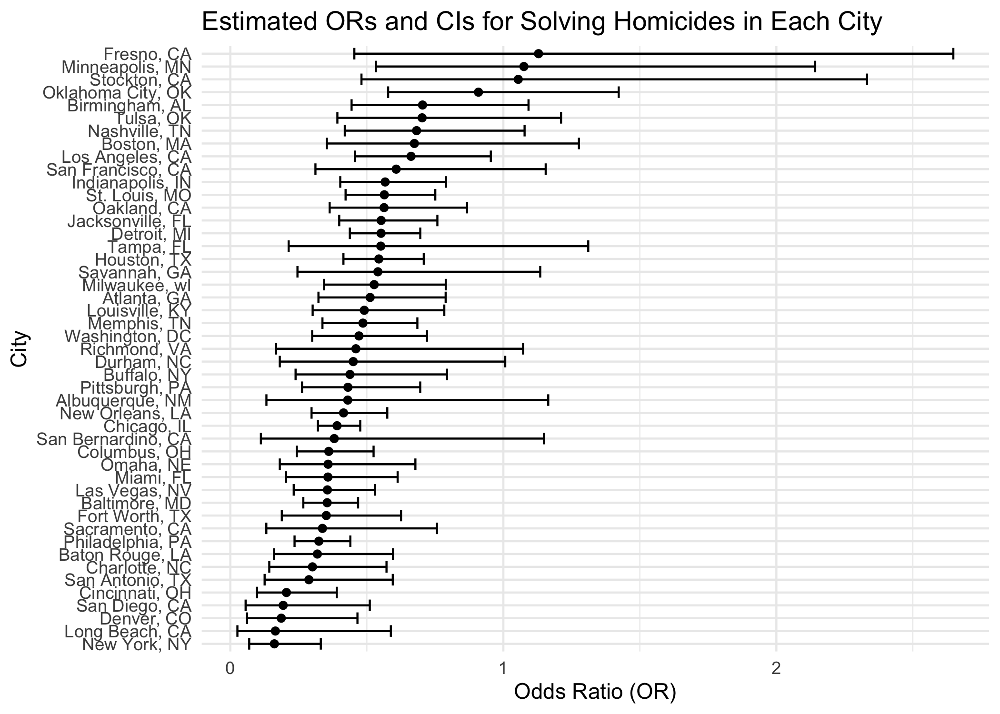

p8105_hw6_NL2836
================
Ngan Le
2023-12-01

``` r
knitr::opts_chunk$set(echo = TRUE)
library(tidyverse)
```

# Question 1

##### Import dataset from CSV file.

``` r
homicide = read_csv("homicide-data.csv") %>% 
  janitor::clean_names()
```

*This dataset includes 52179 observations and 12 variables, reporting
the date, the city, the state, the coordinates of the incidences, the
victims’ name, age, race, gender, and the disposition of the case. The
incidences are reported across 28 states from 2007-2017.*

##### Create a city_state variable (e.g. “Baltimore, MD”), and a binary variable indicating whether the homicide is solved. Omit cities Dallas, TX; Phoenix, AZ; and Kansas City, MO – these don’t report victim race. Also omit Tulsa, AL – this is a data entry mistake. For this problem, limit your analysis those for whom victim_race is white or black. Be sure that victim_age is numeric.

``` r
cleaned_homicide =
  homicide %>%
  mutate(city_state = str_c(city, ", ", state)) %>% 
  mutate(solved = ifelse(disposition %in% c("Closed by arrest","Closed without arrest"), 1, 0)) %>%
  filter(!city_state %in% c("Dallas, TX", "Phoenix, AZ", "Kansas City, MO", "Tulsa, AL")) %>%
  filter(victim_race %in% c("White", "Black")) %>%
  mutate(victim_age = ifelse(victim_age == "unknown", NA, victim_age)) %>%
  mutate(victim_age = as.numeric(victim_age))

cleaned_homicide
```

    ## # A tibble: 39,693 × 14
    ##    uid        reported_date victim_last  victim_first victim_race victim_age
    ##    <chr>              <dbl> <chr>        <chr>        <chr>            <dbl>
    ##  1 Alb-000003      20100601 SATTERFIELD  VIVIANA      White               15
    ##  2 Alb-000005      20100102 MULA         VIVIAN       White               72
    ##  3 Alb-000006      20100126 BOOK         GERALDINE    White               91
    ##  4 Alb-000009      20100130 MARTIN-LEYVA GUSTAVO      White               56
    ##  5 Alb-000012      20100218 LUJAN        KEVIN        White               NA
    ##  6 Alb-000016      20100308 GRAY         STEFANIA     White               43
    ##  7 Alb-000018      20100323 DAVID        LARRY        White               52
    ##  8 Alb-000019      20100402 BRITO        ELIZABETH    White               22
    ##  9 Alb-000021      20100423 KING         TEVION       Black               15
    ## 10 Alb-000022      20100423 BOYKIN       CEDRIC       Black               25
    ## # ℹ 39,683 more rows
    ## # ℹ 8 more variables: victim_sex <chr>, city <chr>, state <chr>, lat <dbl>,
    ## #   lon <dbl>, disposition <chr>, city_state <chr>, solved <dbl>

##### For the city of Baltimore, MD, use the glm function to fit a logistic regression with resolved vs unresolved as the outcome and victim age, sex and race as predictors. Save the output of glm as an R object; apply the broom::tidy to this object; and obtain the estimate and confidence interval of the adjusted odds ratio for solving homicides comparing male victims to female victims keeping all other variables fixed.

``` r
baltimore_glm =
  cleaned_homicide %>%
  filter(city_state == "Baltimore, MD") %>%
  glm(solved ~ victim_age + victim_sex + victim_race, 
             data =., 
             family = binomial) %>% 
  broom::tidy(baltimore_glm, 
              exponentiate = TRUE, 
              conf.int = TRUE, 
              conf.level = 0.95) %>% 
  rename(OR = estimate, 
         CI_lower = conf.low, 
         CI_upper = conf.high,
         p_value = p.value) %>%
  mutate(p_value = ifelse(p_value < 0.05, "<0.05", as.character(round(p_value, 3)))) %>%
  select(term, OR, CI_lower, CI_upper, p_value) %>% 
  knitr::kable(digits = 3)

baltimore_glm
```

| term             |    OR | CI_lower | CI_upper | p_value |
|:-----------------|------:|---------:|---------:|:--------|
| (Intercept)      | 1.942 |    1.383 |    2.744 | \<0.05  |
| victim_age       | 0.995 |    0.988 |    1.001 | 0.11    |
| victim_sexMale   | 0.355 |    0.267 |    0.468 | \<0.05  |
| victim_raceWhite | 2.459 |    1.733 |    3.519 | \<0.05  |

*With the `female` being the reference category for sex and `Black`
being the reference category for race: the odds of having the homicide
case solved among male victims is 0.355 times the odds of having
homicide case solved among female victims. Since the p-value is smaller
than 0.05, we have sufficient evidence to claim that the odds of having
the homicide case solved are significantly different between male and
female victims.*

``` r
cities_glm <- cleaned_homicide %>% 
  group_by(city_state) %>%
  nest() %>%
  mutate(
    regression = map(data, ~glm(formula = solved ~ victim_age + victim_sex + victim_race, data = ., family = binomial())),
    solved_cities = map(regression, ~broom::tidy(.x, exponentiate = TRUE, conf.int = TRUE, conf.level = 0.95))
  ) %>% 
  select(-data, -regression) %>% 
  unnest(solved_cities) %>% 
  filter(term == "victim_sexMale") %>% 
  rename(OR = estimate, 
         CI_lower = conf.low, 
         CI_upper = conf.high,
         p_value = p.value) %>% 
  select(city_state, OR, CI_lower, CI_upper) 

cities_glm
```

    ## # A tibble: 47 × 4
    ## # Groups:   city_state [47]
    ##    city_state         OR CI_lower CI_upper
    ##    <chr>           <dbl>    <dbl>    <dbl>
    ##  1 Albuquerque, NM 0.430   0.132     1.16 
    ##  2 Atlanta, GA     0.512   0.323     0.789
    ##  3 Baltimore, MD   0.355   0.267     0.468
    ##  4 Baton Rouge, LA 0.319   0.160     0.596
    ##  5 Birmingham, AL  0.704   0.444     1.09 
    ##  6 Boston, MA      0.674   0.353     1.28 
    ##  7 Buffalo, NY     0.438   0.239     0.793
    ##  8 Charlotte, NC   0.301   0.143     0.572
    ##  9 Chicago, IL     0.391   0.321     0.476
    ## 10 Cincinnati, OH  0.206   0.0977    0.390
    ## # ℹ 37 more rows

# MISSING DESCRIPTION

##### Create a plot that shows the estimated ORs and CIs for each city. Organize cities according to estimated OR, and comment on the plot.

``` r
OR_plot = 
  ggplot(cities_glm, aes(x = reorder(city_state, OR), y = OR)) +
  geom_point() +
  geom_errorbar(aes(ymin = CI_lower, ymax = CI_upper)) +
  coord_flip() +
  labs(x = "City", y = "Odds Ratio (OR)", 
       title = "Estimated ORs and CIs for Solving Homicides in Each City") +
  theme_minimal()

OR_plot
```

<!-- -->
