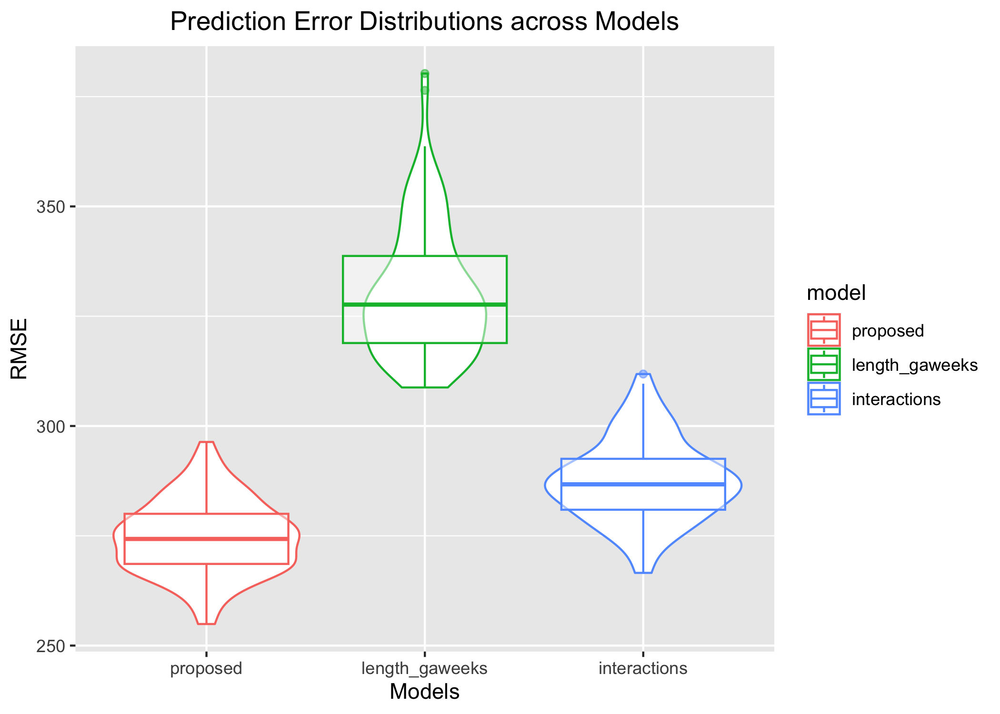

p8105_hw6_NL2836
================
Ngan Le
2023-12-01

``` r
knitr::opts_chunk$set(echo = TRUE)
library(tidyverse)
```

# Question 1

##### Import dataset from CSV file.

``` r
homicide = read_csv("homicide-data.csv") %>% 
  janitor::clean_names()
```

*This dataset includes 52179 observations and 12 variables, reporting
the date, the city, the state, the coordinates of the incidences, the
victims’ name, age, race, gender, and the disposition of the case. The
incidences are reported across 28 states from 2007-2017.*

##### Create a city_state variable (e.g. “Baltimore, MD”), and a binary variable indicating whether the homicide is solved. Omit cities Dallas, TX; Phoenix, AZ; and Kansas City, MO – these don’t report victim race. Also omit Tulsa, AL – this is a data entry mistake. For this problem, limit your analysis those for whom victim_race is white or black. Be sure that victim_age is numeric.

``` r
cleaned_homicide =
  homicide %>%
  mutate(city_state = str_c(city, ", ", state)) %>% 
  mutate(solved = ifelse(disposition %in% c("Closed by arrest","Closed without arrest"), 1, 0)) %>%
  filter(!city_state %in% c("Dallas, TX", "Phoenix, AZ", "Kansas City, MO", "Tulsa, AL")) %>%
  filter(victim_race %in% c("White", "Black")) %>%
  mutate(victim_age = ifelse(victim_age == "unknown", NA, victim_age)) %>%
  mutate(victim_age = as.numeric(victim_age))

cleaned_homicide
```

    ## # A tibble: 39,693 × 14
    ##    uid        reported_date victim_last  victim_first victim_race victim_age
    ##    <chr>              <dbl> <chr>        <chr>        <chr>            <dbl>
    ##  1 Alb-000003      20100601 SATTERFIELD  VIVIANA      White               15
    ##  2 Alb-000005      20100102 MULA         VIVIAN       White               72
    ##  3 Alb-000006      20100126 BOOK         GERALDINE    White               91
    ##  4 Alb-000009      20100130 MARTIN-LEYVA GUSTAVO      White               56
    ##  5 Alb-000012      20100218 LUJAN        KEVIN        White               NA
    ##  6 Alb-000016      20100308 GRAY         STEFANIA     White               43
    ##  7 Alb-000018      20100323 DAVID        LARRY        White               52
    ##  8 Alb-000019      20100402 BRITO        ELIZABETH    White               22
    ##  9 Alb-000021      20100423 KING         TEVION       Black               15
    ## 10 Alb-000022      20100423 BOYKIN       CEDRIC       Black               25
    ## # ℹ 39,683 more rows
    ## # ℹ 8 more variables: victim_sex <chr>, city <chr>, state <chr>, lat <dbl>,
    ## #   lon <dbl>, disposition <chr>, city_state <chr>, solved <dbl>

##### For the city of Baltimore, MD, use the glm function to fit a logistic regression with resolved vs unresolved as the outcome and victim age, sex and race as predictors. Save the output of glm as an R object; apply the broom::tidy to this object; and obtain the estimate and confidence interval of the adjusted odds ratio for solving homicides comparing male victims to female victims keeping all other variables fixed.

``` r
baltimore_glm =
  cleaned_homicide %>%
  filter(city_state == "Baltimore, MD") %>%
  glm(solved ~ victim_age + victim_sex + victim_race, 
             data =., 
             family = binomial) %>% 
  broom::tidy(baltimore_glm, 
              exponentiate = TRUE, 
              conf.int = TRUE, 
              conf.level = 0.95) %>% 
  rename(OR = estimate, 
         CI_lower = conf.low, 
         CI_upper = conf.high,
         p_value = p.value) %>%
  mutate(p_value = ifelse(p_value < 0.05, "<0.05", as.character(round(p_value, 3)))) %>%
  select(term, OR, CI_lower, CI_upper, p_value) %>% 
  knitr::kable(digits = 3)

baltimore_glm
```

| term             |    OR | CI_lower | CI_upper | p_value |
|:-----------------|------:|---------:|---------:|:--------|
| (Intercept)      | 1.942 |    1.383 |    2.744 | \<0.05  |
| victim_age       | 0.995 |    0.988 |    1.001 | 0.11    |
| victim_sexMale   | 0.355 |    0.267 |    0.468 | \<0.05  |
| victim_raceWhite | 2.459 |    1.733 |    3.519 | \<0.05  |

*With the `female` being the reference category for sex and `Black`
being the reference category for race: the odds of having the homicide
case solved among male victims is 0.355 times the odds of having
homicide case solved among female victims (deducted from
`victim_sexMale`). Since the p-value is smaller than 0.05, we have
sufficient evidence to claim that the odds of having the homicide case
solved are significantly different between male and female victims.*

##### Now run glm for each of the cities in your dataset, and extract the adjusted odds ratio (and CI) for solving homicides comparing male victims to female victims. Do this within a “tidy” pipeline, making use of purrr::map, list columns, and unnest as necessary to create a dataframe with estimated ORs and CIs for each city.

``` r
cities_glm <- cleaned_homicide %>% 
  group_by(city_state) %>%
  nest() %>%
  mutate(
    regression = 
      map(data, ~glm(formula = 
                       solved ~ victim_age + 
                       victim_sex + 
                       victim_race, 
                     data = ., 
                     family = binomial()
                     )),
    solved_cities = map(regression, 
                        ~broom::tidy(
                          .x, 
                          exponentiate = TRUE, 
                          conf.int = TRUE, 
                          conf.level = 0.95))
  ) %>% 
  select(-data, -regression) %>% 
  unnest(solved_cities) %>% 
  filter(term == "victim_sexMale") %>% 
  rename(OR = estimate, 
         CI_lower = conf.low, 
         CI_upper = conf.high,
         p_value = p.value) %>% 
  select(city_state, OR, CI_lower, CI_upper) 

cities_glm
```

    ## # A tibble: 47 × 4
    ## # Groups:   city_state [47]
    ##    city_state         OR CI_lower CI_upper
    ##    <chr>           <dbl>    <dbl>    <dbl>
    ##  1 Albuquerque, NM 0.430   0.132     1.16 
    ##  2 Atlanta, GA     0.512   0.323     0.789
    ##  3 Baltimore, MD   0.355   0.267     0.468
    ##  4 Baton Rouge, LA 0.319   0.160     0.596
    ##  5 Birmingham, AL  0.704   0.444     1.09 
    ##  6 Boston, MA      0.674   0.353     1.28 
    ##  7 Buffalo, NY     0.438   0.239     0.793
    ##  8 Charlotte, NC   0.301   0.143     0.572
    ##  9 Chicago, IL     0.391   0.321     0.476
    ## 10 Cincinnati, OH  0.206   0.0977    0.390
    ## # ℹ 37 more rows

*Among 47 cities, adjusting for victim race and age, New York, NY has
the lowest OR (0.16, 95% CI: 0.07 - 0.33) and Fresno, CA has the highest
OR (1.13, 95%: 0.45 - 2.65) for solving homicides comparing male victims
to female victims. Since the 95% CI of the OR for solving homicides
comparing male victims to female victims in New York, NY does not
include the value of 1, this mean the OR is significant, or we have
sufficient evidence to claim that the OR is significantly different
than 1. Using the same logic, we conclude that we do not have sufficient
evidence to claim that the OR for solving homicides comparing male
victims to female victims in Fresno, CA is significantly different
than 1. The city with the highest significant OR is Los Angeles, CA
(0.67, 95% CI: 0.46 - 0.95).*

##### Create a plot that shows the estimated ORs and CIs for each city. Organize cities according to estimated OR, and comment on the plot.

``` r
OR_plot = 
  ggplot(cities_glm, aes(x = reorder(city_state, OR), y = OR)) +
  geom_point() +
  geom_errorbar(aes(ymin = CI_lower, ymax = CI_upper)) +
  coord_flip() +
  labs(x = "City", y = "Odds Ratio (OR)", 
       title = "Estimated ORs and CIs for Solving Homicides in Each City") +
  theme_minimal()+
  theme(axis.text.y = element_text(size = 8))

OR_plot
```

<!-- -->

*In additions to comments above, we can see from the plot that most
cities have the OR for solving homicides comparing male victims to
female victims, adjusting for victim race and age, cluster around 0 and
1, except for Oklahoma City, OK, Stockton, CA, Minneapolis, MN, Fresno,
CA, whose ORs seem to deviate from other cities’ and get larger than 1
(except Oklahoma City). A lot of the error bars of the cities with OR \<
1 do not exceed 1, which indicates significant ORs. We can conclude that
in general, we observe a lower odds of having the homicide cases solved
among male victims compared to that of female victims across 47 cities.
*

# Question 2

###### Use 5000 bootstrap samples and, for each bootstrap sample, produce estimates of these two quantities. Plot the distribution of your estimates, and describe these in words. Using the 5000 bootstrap estimates, identify the 2.5% and 97.5% quantiles to provide a 95% confidence interval for r̂2 and log(β̂0∗β̂1). Note: broom::glance() is helpful for extracting r̂2 from a fitted regression, and broom::tidy() (with some additional wrangling) should help in computing log(β̂1∗β̂2).

``` r
weather_df = 
  rnoaa::meteo_pull_monitors(
    c("USW00094728"),
    var = c("PRCP", "TMIN", "TMAX"), 
    date_min = "2022-01-01",
    date_max = "2022-12-31") |>
  mutate(
    name = recode(id, USW00094728 = "CentralPark_NY"),
    tmin = tmin / 10,
    tmax = tmax / 10) |>
  select(name, id, everything())
```

    ## using cached file: /Users/baonganlengoc/Library/Caches/org.R-project.R/R/rnoaa/noaa_ghcnd/USW00094728.dly

    ## date created (size, mb): 2023-10-19 20:17:38 (8.534)

    ## file min/max dates: 1869-01-01 / 2023-10-31

``` r
model =
  lm(tmax ~ tmin + prcp, data = weather_df)

set.seed(123456)

boot_sample = function(df) {
  sample_frac(df, replace = TRUE)
}

straps = 
  data_frame(
    strap_number = 1:5000,
    strap_sample = rerun(5000, boot_sample(weather_df))
  )
```

    ## Warning: `data_frame()` was deprecated in tibble 1.1.0.
    ## ℹ Please use `tibble()` instead.
    ## This warning is displayed once every 8 hours.
    ## Call `lifecycle::last_lifecycle_warnings()` to see where this warning was
    ## generated.

    ## Warning: `rerun()` was deprecated in purrr 1.0.0.
    ## ℹ Please use `map()` instead.
    ##   # Previously
    ##   rerun(5000, boot_sample(weather_df))
    ## 
    ##   # Now
    ##   map(1:5000, ~ boot_sample(weather_df))
    ## This warning is displayed once every 8 hours.
    ## Call `lifecycle::last_lifecycle_warnings()` to see where this warning was
    ## generated.

``` r
bootstrap_betas = 
  straps %>% 
  mutate(
    models = map(strap_sample, ~lm(tmax ~ tmin + prcp, data = .x) ),
    results = map(models, broom::tidy)) %>% 
  select(-strap_sample, -models) %>% 
  unnest(results) 

log_betas =  
  bootstrap_betas %>%
  group_by(strap_number) %>%
  summarise(log_betas = log(estimate[2] * estimate[3])) %>%
  select(log_betas, strap_number)
```

``` r
bootstrap_r2 = 
  straps %>% 
  mutate(
    models = map(strap_sample, ~lm(tmax ~ tmin + prcp, data = .x) ),
    results = map(models, broom::glance)) %>% 
  select(-strap_sample, -models) %>% 
  unnest(results) 

r_squared = 
  bootstrap_r2 %>%
  select(r.squared, strap_number)
```

``` r
ggplot(log_betas, aes(x = log_betas)) + 
  geom_density() +
  labs(title = "Distribution of log(Beta1 * Beta2)") +
  theme_minimal()
```

<!-- -->

``` r
ggplot(r_squared, aes(x = r.squared)) + 
  geom_density() +
  labs(title = "R-squared Distribution") +
  theme_minimal()
```

<!-- -->

Calculate Mean and SD.

``` r
r2_stat = r_squared %>%
  summarise(r2_sd = sd(r.squared), 
            r2_mean = mean(r.squared)) %>%
  pull(r2_sd, r2_mean)

log_betas_stat = log_betas %>% 
  summarise(log_betas_sd = sd(as.numeric(log_betas),na.rm = TRUE),
           log_betas_mean = mean(as.numeric(log_betas), na.rm = TRUE) ) %>%
  pull(log_betas_sd, log_betas_mean) 

CI_log_betas = log_betas %>%
  summarize(ci_lower = quantile(log_betas, 0.025, na.rm = TRUE),
            ci_upper = quantile(log_betas, 0.975, na.rm = TRUE))

CI_r2 = r_squared %>%
  summarize(ci_lower = quantile(r_squared, 0.025, na.rm = TRUE),
            ci_upper = quantile(r_squared, 0.975, na.rm = TRUE))
```

*R-squared has a mean of 0.917 and a standard deviation (SD) of 0.0136.
95% CI: 0.916, 0.917.*

\_log(b1\*b2) has a 95% CI:-9.13, -4.57.\_

\_The distribution of r-squared is roughly normal, while the
distribution of log(b1\*b2) is left skewed.\_

# Question 3

``` r
birthwt = read_csv("birthweight.csv")
```

``` r
birthwt %>% 
  janitor::clean_names() %>% 
  mutate(
    babysex = ifelse(babysex == "1", "male","female"),
    malform = ifelse(malform == "0", "absent","present"),
    frace = recode(frace, 
                   "1" = "White", 
                   "2" = "Black", 
                   "3" = "Asian", 
                   "4" = "Puerto Rican", 
                   "8" = "Other", 
                   "9" = "Unknown"),
    mrace = recode(mrace, 
                   "1" = "White", 
                   "2" = "Black", 
                   "3" = "Asian", 
                   "4" = "Puerto Rican", 
                   "8" = "Other")
    ) %>%
   mutate(
    babysex = as.factor(babysex),
    frace = as.factor(frace),
    malform = as.factor(malform),
    mrace = as.factor(mrace),
    parity = as.factor(parity),
    pnumlbw = as.factor(pnumlbw),
    pnumsga = as.factor(pnumsga)
    )
```

    ## # A tibble: 4,342 × 20
    ##    babysex bhead blength   bwt delwt fincome frace gaweeks malform menarche
    ##    <fct>   <dbl>   <dbl> <dbl> <dbl>   <dbl> <fct>   <dbl> <fct>      <dbl>
    ##  1 female     34      51  3629   177      35 White    39.9 absent        13
    ##  2 male       34      48  3062   156      65 Black    25.9 absent        14
    ##  3 female     36      50  3345   148      85 White    39.9 absent        12
    ##  4 male       34      52  3062   157      55 White    40   absent        14
    ##  5 female     34      52  3374   156       5 White    41.6 absent        13
    ##  6 male       33      52  3374   129      55 White    40.7 absent        12
    ##  7 female     33      46  2523   126      96 Black    40.3 absent        14
    ##  8 female     33      49  2778   140       5 White    37.4 absent        12
    ##  9 male       36      52  3515   146      85 White    40.3 absent        11
    ## 10 male       33      50  3459   169      75 Black    40.7 absent        12
    ## # ℹ 4,332 more rows
    ## # ℹ 10 more variables: mheight <dbl>, momage <dbl>, mrace <fct>, parity <fct>,
    ## #   pnumlbw <fct>, pnumsga <fct>, ppbmi <dbl>, ppwt <dbl>, smoken <dbl>,
    ## #   wtgain <dbl>

``` r
skimr::skim(birthwt)
```

|                                                  |         |
|:-------------------------------------------------|:--------|
| Name                                             | birthwt |
| Number of rows                                   | 4342    |
| Number of columns                                | 20      |
| \_\_\_\_\_\_\_\_\_\_\_\_\_\_\_\_\_\_\_\_\_\_\_   |         |
| Column type frequency:                           |         |
| numeric                                          | 20      |
| \_\_\_\_\_\_\_\_\_\_\_\_\_\_\_\_\_\_\_\_\_\_\_\_ |         |
| Group variables                                  | None    |

Data summary

**Variable type: numeric**

| skim_variable | n_missing | complete_rate |    mean |     sd |     p0 |     p25 |     p50 |     p75 |   p100 | hist  |
|:--------------|----------:|--------------:|--------:|-------:|-------:|--------:|--------:|--------:|-------:|:------|
| babysex       |         0 |             1 |    1.49 |   0.50 |   1.00 |    1.00 |    1.00 |    2.00 |    2.0 | ▇▁▁▁▇ |
| bhead         |         0 |             1 |   33.65 |   1.62 |  21.00 |   33.00 |   34.00 |   35.00 |   41.0 | ▁▁▆▇▁ |
| blength       |         0 |             1 |   49.75 |   2.72 |  20.00 |   48.00 |   50.00 |   51.00 |   63.0 | ▁▁▁▇▁ |
| bwt           |         0 |             1 | 3114.40 | 512.15 | 595.00 | 2807.00 | 3132.50 | 3459.00 | 4791.0 | ▁▁▇▇▁ |
| delwt         |         0 |             1 |  145.57 |  22.21 |  86.00 |  131.00 |  143.00 |  157.00 |  334.0 | ▅▇▁▁▁ |
| fincome       |         0 |             1 |   44.11 |  25.98 |   0.00 |   25.00 |   35.00 |   65.00 |   96.0 | ▃▇▅▂▃ |
| frace         |         0 |             1 |    1.66 |   0.85 |   1.00 |    1.00 |    2.00 |    2.00 |    8.0 | ▇▁▁▁▁ |
| gaweeks       |         0 |             1 |   39.43 |   3.15 |  17.70 |   38.30 |   39.90 |   41.10 |   51.3 | ▁▁▂▇▁ |
| malform       |         0 |             1 |    0.00 |   0.06 |   0.00 |    0.00 |    0.00 |    0.00 |    1.0 | ▇▁▁▁▁ |
| menarche      |         0 |             1 |   12.51 |   1.48 |   0.00 |   12.00 |   12.00 |   13.00 |   19.0 | ▁▁▂▇▁ |
| mheight       |         0 |             1 |   63.49 |   2.66 |  48.00 |   62.00 |   63.00 |   65.00 |   77.0 | ▁▁▇▂▁ |
| momage        |         0 |             1 |   20.30 |   3.88 |  12.00 |   18.00 |   20.00 |   22.00 |   44.0 | ▅▇▂▁▁ |
| mrace         |         0 |             1 |    1.63 |   0.77 |   1.00 |    1.00 |    2.00 |    2.00 |    4.0 | ▇▇▁▁▁ |
| parity        |         0 |             1 |    0.00 |   0.10 |   0.00 |    0.00 |    0.00 |    0.00 |    6.0 | ▇▁▁▁▁ |
| pnumlbw       |         0 |             1 |    0.00 |   0.00 |   0.00 |    0.00 |    0.00 |    0.00 |    0.0 | ▁▁▇▁▁ |
| pnumsga       |         0 |             1 |    0.00 |   0.00 |   0.00 |    0.00 |    0.00 |    0.00 |    0.0 | ▁▁▇▁▁ |
| ppbmi         |         0 |             1 |   21.57 |   3.18 |  13.07 |   19.53 |   21.03 |   22.91 |   46.1 | ▃▇▁▁▁ |
| ppwt          |         0 |             1 |  123.49 |  20.16 |  70.00 |  110.00 |  120.00 |  134.00 |  287.0 | ▅▇▁▁▁ |
| smoken        |         0 |             1 |    4.15 |   7.41 |   0.00 |    0.00 |    0.00 |    5.00 |   60.0 | ▇▁▁▁▁ |
| wtgain        |         0 |             1 |   22.08 |  10.94 | -46.00 |   15.00 |   22.00 |   28.00 |   89.0 | ▁▁▇▁▁ |

*No missing data, no need for further cleaning.*

Using stepwise regression to determine best model

``` r
initial_model = lm(bwt ~ ., data = birthwt)
summary(initial_model)
```

    ## 
    ## Call:
    ## lm(formula = bwt ~ ., data = birthwt)
    ## 
    ## Residuals:
    ##      Min       1Q   Median       3Q      Max 
    ## -1081.29  -184.01    -4.34   174.29  2425.18 
    ## 
    ## Coefficients: (3 not defined because of singularities)
    ##               Estimate Std. Error t value Pr(>|t|)    
    ## (Intercept) -6201.9274   668.2669  -9.281  < 2e-16 ***
    ## babysex        32.3397     8.5490   3.783 0.000157 ***
    ## bhead         134.4216     3.4705  38.733  < 2e-16 ***
    ## blength        76.3778     2.0384  37.469  < 2e-16 ***
    ## delwt           3.9571     0.3989   9.921  < 2e-16 ***
    ## fincome         0.6543     0.1776   3.684 0.000232 ***
    ## frace          -5.8678     8.7969  -0.667 0.504788    
    ## gaweeks        12.0387     1.4809   8.129 5.59e-16 ***
    ## malform        14.2400    71.4190   0.199 0.841969    
    ## menarche       -4.2630     2.9242  -1.458 0.144957    
    ## mheight         4.7511    10.4062   0.457 0.648002    
    ## momage          3.4425     1.1930   2.886 0.003927 ** 
    ## mrace         -48.1943     9.9575  -4.840 1.34e-06 ***
    ## parity         89.8788    40.9290   2.196 0.028147 *  
    ## pnumlbw             NA         NA      NA       NA    
    ## pnumsga             NA         NA      NA       NA    
    ## ppbmi          -0.9683    15.0322  -0.064 0.948642    
    ## ppwt           -2.6603     2.6384  -1.008 0.313354    
    ## smoken         -3.7220     0.5819  -6.396 1.76e-10 ***
    ## wtgain              NA         NA      NA       NA    
    ## ---
    ## Signif. codes:  0 '***' 0.001 '**' 0.01 '*' 0.05 '.' 0.1 ' ' 1
    ## 
    ## Residual standard error: 275.5 on 4325 degrees of freedom
    ## Multiple R-squared:  0.7116, Adjusted R-squared:  0.7105 
    ## F-statistic:   667 on 16 and 4325 DF,  p-value: < 2.2e-16

``` r
step(initial_model, direction = 'both')
```

    ## Start:  AIC=48810.15
    ## bwt ~ babysex + bhead + blength + delwt + fincome + frace + gaweeks + 
    ##     malform + menarche + mheight + momage + mrace + parity + 
    ##     pnumlbw + pnumsga + ppbmi + ppwt + smoken + wtgain
    ## 
    ## 
    ## Step:  AIC=48810.15
    ## bwt ~ babysex + bhead + blength + delwt + fincome + frace + gaweeks + 
    ##     malform + menarche + mheight + momage + mrace + parity + 
    ##     pnumlbw + pnumsga + ppbmi + ppwt + smoken
    ## 
    ## 
    ## Step:  AIC=48810.15
    ## bwt ~ babysex + bhead + blength + delwt + fincome + frace + gaweeks + 
    ##     malform + menarche + mheight + momage + mrace + parity + 
    ##     pnumlbw + ppbmi + ppwt + smoken
    ## 
    ## 
    ## Step:  AIC=48810.15
    ## bwt ~ babysex + bhead + blength + delwt + fincome + frace + gaweeks + 
    ##     malform + menarche + mheight + momage + mrace + parity + 
    ##     ppbmi + ppwt + smoken
    ## 
    ##            Df Sum of Sq       RSS   AIC
    ## - ppbmi     1       315 328372167 48808
    ## - malform   1      3018 328374870 48808
    ## - mheight   1     15827 328387679 48808
    ## - frace     1     33781 328405633 48809
    ## - ppwt      1     77194 328449045 48809
    ## <none>                  328371852 48810
    ## - menarche  1    161362 328533213 48810
    ## - parity    1    366128 328737979 48813
    ## - momage    1    632160 329004012 48816
    ## - fincome   1   1030574 329402426 48822
    ## - babysex   1   1086475 329458327 48822
    ## - mrace     1   1778556 330150407 48832
    ## - smoken    1   3106197 331478048 48849
    ## - gaweeks   1   5017414 333389265 48874
    ## - delwt     1   7473440 335845292 48906
    ## - blength   1 106590743 434962595 50029
    ## - bhead     1 113902511 442274363 50101
    ## 
    ## Step:  AIC=48808.15
    ## bwt ~ babysex + bhead + blength + delwt + fincome + frace + gaweeks + 
    ##     malform + menarche + mheight + momage + mrace + parity + 
    ##     ppwt + smoken
    ## 
    ##            Df Sum of Sq       RSS   AIC
    ## - malform   1      3033 328375200 48806
    ## - frace     1     33825 328405992 48807
    ## <none>                  328372167 48808
    ## - menarche  1    161091 328533258 48808
    ## + ppbmi     1       315 328371852 48810
    ## - parity    1    366498 328738665 48811
    ## - momage    1    632022 329004189 48815
    ## - mheight   1    675684 329047851 48815
    ## - fincome   1   1030291 329402457 48820
    ## - babysex   1   1086908 329459074 48820
    ## - mrace     1   1778610 330150776 48830
    ## - smoken    1   3105969 331478135 48847
    ## - ppwt      1   3179601 331551767 48848
    ## - gaweeks   1   5018627 333390793 48872
    ## - delwt     1   7474996 335847163 48904
    ## - blength   1 106590460 434962626 50027
    ## - bhead     1 113972011 442344178 50100
    ## 
    ## Step:  AIC=48806.19
    ## bwt ~ babysex + bhead + blength + delwt + fincome + frace + gaweeks + 
    ##     menarche + mheight + momage + mrace + parity + ppwt + smoken
    ## 
    ##            Df Sum of Sq       RSS   AIC
    ## - frace     1     33987 328409187 48805
    ## <none>                  328375200 48806
    ## - menarche  1    161625 328536825 48806
    ## + malform   1      3033 328372167 48808
    ## + ppbmi     1       330 328374870 48808
    ## - parity    1    366217 328741417 48809
    ## - momage    1    634318 329009517 48813
    ## - mheight   1    674643 329049842 48813
    ## - fincome   1   1028426 329403626 48818
    ## - babysex   1   1085480 329460680 48819
    ## - mrace     1   1780124 330155324 48828
    ## - smoken    1   3103025 331478225 48845
    ## - ppwt      1   3188216 331563416 48846
    ## - gaweeks   1   5016626 333391826 48870
    ## - delwt     1   7493191 335868391 48902
    ## - blength   1 106598488 434973688 50025
    ## - bhead     1 113989429 442364629 50098
    ## 
    ## Step:  AIC=48804.64
    ## bwt ~ babysex + bhead + blength + delwt + fincome + gaweeks + 
    ##     menarche + mheight + momage + mrace + parity + ppwt + smoken
    ## 
    ##            Df Sum of Sq       RSS   AIC
    ## <none>                  328409187 48805
    ## - menarche  1    165498 328574685 48805
    ## + frace     1     33987 328375200 48806
    ## + malform   1      3194 328405992 48807
    ## + ppbmi     1       376 328408811 48807
    ## - parity    1    366935 328776121 48807
    ## - momage    1    637125 329046311 48811
    ## - mheight   1    683740 329092927 48812
    ## - fincome   1   1050875 329460062 48817
    ## - babysex   1   1085276 329494463 48817
    ## - smoken    1   3092717 331501903 48843
    ## - ppwt      1   3192334 331601520 48845
    ## - gaweeks   1   5019197 333428383 48868
    ## - mrace     1   5999337 334408523 48881
    ## - delwt     1   7480901 335890088 48900
    ## - blength   1 106612808 435021995 50023
    ## - bhead     1 114005059 442414245 50096

    ## 
    ## Call:
    ## lm(formula = bwt ~ babysex + bhead + blength + delwt + fincome + 
    ##     gaweeks + menarche + mheight + momage + mrace + parity + 
    ##     ppwt + smoken, data = birthwt)
    ## 
    ## Coefficients:
    ## (Intercept)      babysex        bhead      blength        delwt      fincome  
    ##  -6246.3672      32.3171     134.4298      76.3760       3.9564       0.6597  
    ##     gaweeks     menarche      mheight       momage        mrace       parity  
    ##     12.0396      -4.3140       5.4408       3.4549     -53.4990      89.9677  
    ##        ppwt       smoken  
    ##     -2.8323      -3.7116

*Suggested model is bwt ~ babysex + bhead + blength + delwt + fincome +
gaweeks + mheight + mrace + parity + ppwt + smoken, data = birthwt*

Build new model with covariates selection from stepwise regression
above.

``` r
final_model = 
  lm(bwt ~ babysex + bhead + blength + delwt + fincome + gaweeks + mheight + mrace + parity + ppwt + smoken, data = birthwt)

summary(final_model)%>%
  broom::tidy() %>%
  select(term, estimate, p.value)
```

    ## # A tibble: 12 × 3
    ##    term         estimate   p.value
    ##    <chr>           <dbl>     <dbl>
    ##  1 (Intercept) -6246.    0        
    ##  2 babysex        31.8   2.06e-  4
    ##  3 bhead         135.    2.66e-283
    ##  4 blength        76.4   1.15e-266
    ##  5 delwt           3.87  2.72e- 22
    ##  6 fincome         0.802 2.66e-  6
    ##  7 gaweeks        12.3   1.12e- 16
    ##  8 mheight         5.14  4.34e-  3
    ##  9 mrace         -55.6   2.41e- 20
    ## 10 parity         97.6   1.69e-  2
    ## 11 ppwt           -2.64  1.04e-  9
    ## 12 smoken         -3.67  3.00e- 10

``` r
summary(final_model)%>%
  broom::glance()
```

    ## # A tibble: 1 × 8
    ##   r.squared adj.r.squared sigma statistic p.value    df df.residual  nobs
    ##       <dbl>         <dbl> <dbl>     <dbl>   <dbl> <dbl>       <int> <dbl>
    ## 1     0.711         0.710  276.      968.       0    11        4330  4342

*All variables in the model demonstrate significant p-values (less than
0.05), indicating their statistical significance. Furthermore, the model
exhibits an adjusted R-squared value of 0.710, which suggests that 71.0%
of the variation in birthweight is accounted for by these variables.
This implies that the variables included in the model have a strong and
significant association with birthweight.*

``` r
birthwt %>% 
  modelr::add_residuals(initial_model) %>%
  modelr::add_predictions(final_model) %>% 
  ggplot(aes(x = pred, y = resid)) + 
  geom_point(alpha = 0.3) +
  labs(
    title = "Residuals vs Chosen Fitted Plot for Birthweight Model",
    x = "Fited values",
    y = "Residuals"
    ) +
  theme(plot.title = element_text(hjust = 0.5))+
  geom_line(aes(y = 0), color = "red")
```

    ## Warning in predict.lm(model, data): prediction from a rank-deficient fit may be
    ## misleading

<!-- -->

*Residuals scatter randomly around 0.*

``` r
model_1 = lm(bwt ~ blength + gaweeks, data = birthwt)

model_2 = lm(bwt ~ bhead + blength + babysex + bhead * blength + bhead * babysex + blength * babysex + bhead * blength * babysex, data = birthwt)
```

``` r
set.seed(234567)

cross_validation = 
  modelr::crossv_mc(birthwt, 100)
  

cv = cross_validation %>%
   mutate(
    train = map(train, as_tibble),
    test = map(test, as_tibble))

cv_df =
  cross_validation %>%
   mutate(
    train = map(train, as_tibble),
    test = map(test, as_tibble))

cv_df =
  cv_df %>%
    mutate(
    proposed = map(train, ~lm(bwt ~ babysex + bhead + blength + delwt + fincome + gaweeks + mheight + mrace + parity + ppwt + smoken, data = .x)),
    model_length_gaweeks = map(train, ~lm(bwt ~ blength + gaweeks, data = .x)),
    model_interactions  = map(train, ~lm(bwt ~ (bhead + blength + babysex)^3, data = .x))
    ) %>%
   mutate(
    rmse_proposed = map2_dbl(proposed, test, ~modelr::rmse(model = .x, data = .y)),
    rmse_length_gaweeks = map2_dbl(model_length_gaweeks, test, ~modelr::rmse(model = .x, data = .y)),
    rmse_interactions = map2_dbl(model_interactions, test, ~modelr::rmse(model = .x, data = .y))
   )
```

    ## Warning: There were 2 warnings in `mutate()`.
    ## The first warning was:
    ## ℹ In argument: `rmse_proposed = map2_dbl(proposed, test, ~modelr::rmse(model =
    ##   .x, data = .y))`.
    ## Caused by warning in `predict.lm()`:
    ## ! prediction from a rank-deficient fit may be misleading
    ## ℹ Run `dplyr::last_dplyr_warnings()` to see the 1 remaining warning.

``` r
cv_df %>% 
  select(starts_with("rmse")) %>% 
  pivot_longer(
    everything(),
    names_to = "model", 
    values_to = "rmse",
    names_prefix = "rmse_") %>% 
  mutate(model = fct_inorder(model)) %>% 
  ggplot(aes(x = model, y = rmse, color=model)) + 
  geom_violin() +   geom_boxplot(alpha = 0.5)+
  labs(title = 
  "Prediction Error Distributions across Models", 
       x = "Models", y = "RMSE") +
  theme(plot.title = element_text(hjust = 0.5))
```

<!-- -->

*`Proposed` model shown to be the best option due to lowest RMSE.*
